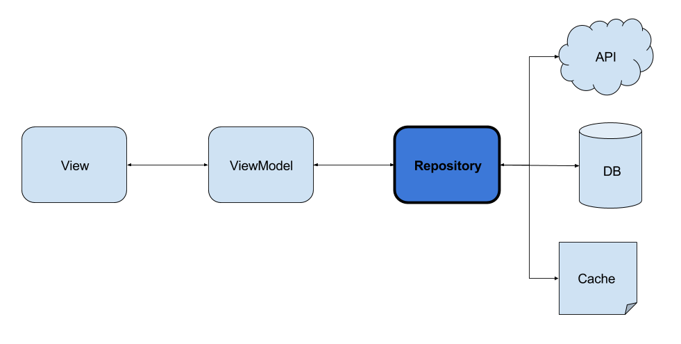

# App Events
- 
- 
- 

## Introduction
**Events** is a playground application that a shows a list of events where it is possible to view the details, view the location in google maps and perform the check-in.

## Architecture
The app uses **MVVM** as its architecture, as Google's own recommendation.

## Frameworks

## Preview

